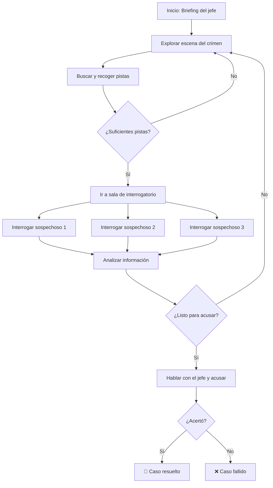

# 🎮 Game Design Document (GDD)
## "Detective Noir VR" — *Working Title*

> **Estado:** Plantilla/Borrador  
> **Versión:** 0.2  
> **Fecha:** 6 de abril de 2026  
> **Equipo:** 4 integrantes — Ignacio Cuevas, Martin Cevallos, Sofia Meza, Diego Espinosa  
> **Asignatura:** ICI5442 – Tecnologías Emergentes  
> **Motor:** Godot 4 + OpenXR + XR Tools  
> **Plataforma:** Meta Quest 2  

---

## 1. Visión General

### 1.1. Concepto del Juego
Un juego de detectives en primera persona en Realidad Virtual donde el jugador investiga un crimen. Debe explorar escenarios, recoger pistas e interrogar sospechosos controlados por un LLM con personalidades únicas, usando su propia voz (Speech-to-Text). El entorno general y la interfaz están en español, pero **todos los NPCs hablan en inglés**, y **el jugador está obligado a hablar en inglés** para interrogar. Un asistente de IA integrado escucha al jugador y, si se equivoca, salta para corregir los errores e indicarle cómo debió decirlo. El objetivo es descubrir al culpable y presentar tu caso al jefe.

### 1.2. Género
Noir / Detective / Misterio / Aventura narrativa

### 1.3. Plataforma
- **Meta Quest 2** (standalone, proporcionado por la universidad)

### 1.4. Audiencia Objetivo
- Jugadores de VR interesados en narrativa e inmersión
- Personas que quieran practicar inglés en un contexto interactivo e inmersivo

### 1.5. Propuesta de Valor Única (USP)
La primera experiencia VR noir donde cada interrogatorio es único gracias a IA generativa con voz, y además te enseña inglés de forma natural.

### 1.6. Componente Educativo
La interfaz general (menús, inventario) y la voz del ayudante están en **español**, pero el contenido core del juego está en **inglés**. 
- Los NPCs hablan 100% en inglés.
- El jugador (mediante detección de voz) **debe** hablar e interrogar en inglés.
- **Mecánica de corrección:** El ayudante LLM analiza lo que el jugador acaba de decir (Speech-to-Text). Si el jugador comete un error gramatical o de pronunciación grave, el ayudante interviene de inmediato y le dice (en español) en qué se equivocó y cómo debió decir la frase correctamente.

---

## 2. Gameplay

### 2.1. Core Loop (Bucle Principal)
```
Explorar escenario → Encontrar pistas → Interrogar sospechosos (voz) → Formular hipótesis → Acusar ante el jefe
```

### 2.2. Mecánicas Principales

| Mecánica | Descripción | Prioridad |
|----------|------------|-----------|
| Exploración VR | Moverse por el escenario en primera persona | 🔴 Alta |
| Recolección de pistas | Interactuar con objetos para recoger evidencia | 🔴 Alta |
| Interrogatorio por voz | Hablar con NPCs usando micrófono, responden vía LLM | 🔴 Alta |
| Inventario de pistas | Sistema para revisar las pistas encontradas | 🟡 Media |
| Acusación final | Presentar pruebas y nombrar al culpable al jefe | 🔴 Alta |
| Asistente de inglés | LLM auxiliar para aprendizaje de inglés contextual | 🟡 Media |
| `[Otra mecánica]` | `[TODO]` | `[TODO]` |

### 2.3. Controles VR (Meta Quest 2)

| Acción | Control Quest 2 |
|--------|----------------|
| Moverse | Joystick izquierdo (continuo) o teletransporte |
| Girar vista | Joystick derecho (snap turn 45°) |
| Agarrar objetos/pistas | Grip button (mano) |
| Interactuar con NPC | Acercarse + Trigger button |
| Hablar (STT) | Mantener presionado A/X o activación por proximidad |
| Abrir inventario de pistas | Botón menú o gesto (mirar la muñeca) |
| Llamar asistente de inglés | Automático (cuando el jugador comete un error) o botón Y/B |

### 2.4. Flujo de una Partida


---

## 3. Narrativa

### 3.1. Ambientación
Ciudad ficticia hispana de estilo años 50 — noches lluviosas, calles empedradas, jazz de fondo. El caso transcurre **íntegramente** en el interior del club nocturno **"El Cisne Negro"**, durante la noche de su gala anual. Luces de neón, humo de cigarrillo, un piano en el escenario y un cadáver en la oficina del dueño.

### 3.2. Historia del Caso: *"La Última Nota en El Cisne Negro"*

**La víctima:** Ernesto Villanueva (52 años), dueño del club. Hallado muerto de un disparo en el pecho dentro de su oficina con llave. La caja fuerte aparece abierta y los papeles revueltos — escenificado para parecer un robo.

**La verdad:** Ramona Villanueva, la hermana estrangulada de Ernesto y heredera original del club (dejado por su padre), descubrió esa semana que Ernesto había modificado el testamento para excluirla al enterarse de que ella conspiraba con inversores para arrebatarle la propiedad. Ramona acudió a la gala, entró a la oficina por el pasillo de servicio (que conocía de niña), confrontó a Ernesto y, al negarse éste a revertir el testamento, lo disparó con una pistola de pequeño calibre que luego arrojó a la fuente ornamental del club. Fingió haber llegado tarde a la fiesta.

---

### 3.3. Personajes

#### El Jugador — El Detective
| Campo | Valor |
|-------|-------|
| Nombre | Limonchero |
| Trasfondo | Detective latino que viaja a Estados Unidos a resolver crímenes. |
| Motivación | Ser el mejor detective del mundo resolviendo casos difíciles. |

---

#### NPC Especial: Félix "El Viejo" Durán — El Ayudante
| Campo | Valor |
|-------|-------|
| Nombre | Félix Durán, apodado "El Viejo" |
| Rol | Mentor retirado de Limonchero. Recorre el escenario y no solo responde preguntas, sino que monitoriza constantemente tu inglés (LLM Corrector evalúa el STT). |
| Personalidad | Sabio, irónico. Un ex-detective latino que domina el inglés. Nunca da la respuesta directa del caso. Habla en español para corregirte y apoyarte. |
| Lo que sabe | Todo el contexto del caso. Sabe qué fue lo que quisiste decir y dónde te equivocaste gramaticalmente. |
| Prompt base LLM | `Eres Félix "El Viejo" Durán, mentor del detective Limonchero. El jugador te pasará su última frase en inglés (junto con la intención de lo que quería decir). Tu deber es decirle CÓMO SE DICE correctamente en inglés, señalando su error de forma irónica pero constructiva (en español). Además, puedes darle pistas sutiles sobre el caso sin revelar al asesino.` |

---

#### NPC Autoridad: Comisario Rodrigo Aparicio — El Jefe
| Campo | Valor |
|-------|-------|
| Nombre | Comisario Rodrigo Aparicio |
| Rol | Asigna el caso al inicio. Recibe la acusación final con las pruebas. Evalúa si la acusación es correcta. |
| Personalidad | Impaciente, burocrático, habla estrictamente en INGLÉS. |
| Prompt base LLM | `Eres Police Chief Aparicio. Hablas SOLO EN INGLÉS. Eres impaciente y exiges resultados rápidos de Limonchero. Al final, evalúa si te nombra a Ramona Villanueva Y presenta las pruebas.` |

---

#### Sospechoso 1: Sofía Ramos — La Cantante
| Campo | Valor |
|-------|-------|
| Nombre | Sofía Ramos, 30 años |
| Relación con la víctima | Cantante estrella del club y ex amante secreta de Ernesto. Él terminó la relación y planeaba despedirla. |
| Personalidad | Emocional, apasionada, dramática. Alterna entre el llanto y el orgullo herido. |
| Info que posee | Escuchó una discusión de voces fuertes en la oficina alrededor de las 22:00 h, pero no vio a nadie entrar ni salir. |
| Lo que oculta | La aventura amorosa. Amenazó a Ernesto con exponer su infidelidad a los inversores del club. |
| ¿Es culpable? | **No** |
| Coartada | Estaba retocándose el maquillaje en el camerino a las 22:00 h. Verificable por la camarera, pero con un hueco de ~20 minutos. |
| Prompt LLM | `You are Sofia Ramos. You speak ONLY IN ENGLISH. You are devastated but also resentful about Ernesto's death. You deny any romantic involvement. If the detective brings up letters or witnesses, you may crack and reveal the affair. You heard the argument but saw no one.` |

---

#### Sospechoso 2: Don Alberto Fuentes — El Socio
| Campo | Valor |
|-------|-------|
| Nombre | Alberto Fuentes, 58 años |
| Relación con la víctima | Socio comercial. Quería vender el club a una inmobiliaria; Ernesto se negó. Ernesto había descubierto que Alberto vendía participaciones ilegalmente. |
| Personalidad | Arrogante, calculador, aparenta cooperación y elegancia. Se pone a la defensiva si se mencionan las cuentas. |
| Info que posee | Sabe que Ramona llamó a Ernesto varias veces durante la tarde, visiblemente enfadada. Vio a Ramona entrar al ala de oficinas cerca de las 21:50 h. |
| Lo que oculta | El fraude con las participaciones del club (malversación que Ernesto había descubierto ese día). |
| ¿Es culpable? | **No** |
| Coartada | Afirma haber estado en la barra charlando con clientes toda la noche. Parcialmente cierto, pero se ausentó ~30 minutos. |
| Prompt LLM | `You are Alberto Fuentes. You speak ONLY IN ENGLISH. You are polite and cooperative on the surface. If the detective mentions the financial accounts or shares, you get defensive. You confirm Ramona was there and went to the office wing only if asked directly.` |

---

#### Sospechoso 3: Víctor "La Víbora" Salas — El Proveedor
| Campo | Valor |
|-------|-------|
| Nombre | Víctor Salas, 44 años |
| Relación con la víctima | Proveedor ilegal de alcohol. Ernesto le debía dinero y amenazaba con cortarle y denunciarle. |
| Personalidad | Nervioso, evasivo, usa jerga callejera. Se intimida cuando se le acorrala pero no es violento. |
| Info que posee | Vio a alguien (silueta femenina, no puede confirmar quién) entrar al pasillo de servicio alrededor de las 22:10 h. |
| Lo que oculta | Su red de suministro ilegal y la deuda de Ernesto con él (€8.000). |
| ¿Es culpable? | **No** |
| Coartada | Afirma estar en el almacén haciendo inventario con un empleado. El empleado lo confirma, pero hay un hueco de 15 minutos. |
| Prompt LLM | `You are Victor Salas. You speak ONLY IN ENGLISH. You are nervous. You deny conflicts with Ernesto unless presented with proof of his debt or your illegal supplies. You saw a female silhouette enter the service hallway, but didn't see the face.` |

---

#### Sospechoso 4: Ramona Villanueva — La Hermana *(culpable)*
| Campo | Valor |
|-------|-------|
| Nombre | Ramona Villanueva, 48 años |
| Relación con la víctima | Hermana de Ernesto. Heredera original del club (legado de su padre). Excluida del nuevo testamento. |
| Personalidad | Fría, calculadora, máscara de serenidad absoluta. Se tensa si se mencionan el testamento, el pasillo de servicio o el pañuelo. |
| Info que posee | Todo. Lo hizo ella. |
| Lo que oculta | Su entrada por el pasillo de servicio, la discusión, el disparo, la pistola arrojada a la fuente ornamental. |
| ¿Es culpable? | **Sí** |
| Coartada | Afirma haber llegado al club tarde (23:00 h) y haberse quedado en el salón principal. Varios testigos la vieron en el salón, pero esto es posterior al crimen (~22:30 h en adelante). |
| Cómo lo hizo | Conocía el pasillo de servicio de la infancia. Entró por él, confrontó a Ernesto, disparó cuando éste se negó a revertir el testamento, escenificó el robo y salió por el mismo pasillo. Arrojó la pistola a la fuente del vestíbulo al mezclarse con los invitados. |
| Prompt LLM | `You are Ramona Villanueva. You speak ONLY IN ENGLISH. You are extremely calm and polite. You deny being near the office. Never confess unless presented with the will, the handkerchief, and the bullet casing simultaneously.` |

---

### 3.4. Listado de Pistas

| # | Pista | Ubicación en el escenario | Relevancia | Conecta con |
|---|-------|--------------------------|-----------|-------------|
| 1 | **El Testamento** — Documento legal que muestra que Ernesto cambió su testamento esa semana, excluyendo a Ramona | Escritorio de la oficina (sobre la mesa) | 🔴 Alta | Ramona (móvil) |
| 2 | **El Pañuelo "R.V."** — Pañuelo con iniciales bordadas y rastro de perfume, hallado en la entrada del pasillo de servicio | Pasillo de servicio (en el suelo) | 🔴 Alta | Ramona (coloca en la escena) |
| 3 | **El Casquillo** — Vaina de bala de pequeño calibre detrás de la estantería caída | Oficina (detrás del mueble) | 🔴 Alta | Arma del crimen (desmiente el "robo") |
| 4 | **El Diario de Ernesto** — Pequeña libreta en cajón cerrado con llave. Última entrada: *"Ramona viene esta noche. Ya sabe del testamento. Temo lo peor."* | Cajón bajo llave del escritorio | 🟡 Media | Ramona (amenaza previa) |
| 5 | **El Registro de Llamadas** — Papel en la mesa con 3 llamadas de un número externo esa tarde (confirmado por Alberto como el número de Ramona) | Mesa auxiliar de la oficina | 🟡 Media | Ramona (contacto hostil previo) |

---

## 4. Diseño de Niveles / Escenarios

> **Nivel único:** Todo el juego transcurre en el club nocturno **"El Cisne Negro"**. El escenario es uno solo, con varias zonas navegables de forma libre dentro del club.

### 4.1. Mapa General del Club "El Cisne Negro"
```
                    [ ENTRADA / VESTÍBULO ]
                         |        |
                   [fuente]   [guardarropa]
                         |
              [ SALÓN PRINCIPAL ]
            /          |           \
    [escenario]    [pista baile]   [barra]
                         |
              [ PASILLO INTERIOR ]
            /                       \
  [baños / camerino]        [ ALA DE OFICINAS ]
                                    |
                         [ OFICINA DE ERNESTO ]  ← escena del crimen
                                    |
                         [ PASILLO DE SERVICIO ]  ← ruta de Ramona
                                    |
                         [ ALMACÉN / BODEGA ]
```

### 4.2. Zonas del Escenario Único

#### Zona 1: Vestíbulo / Entrada
- **Propósito:** Zona de entrada, presenta el ambiente del club y la noche de la gala.
- **Elementos interactuables:** Fuente ornamental (pistola sumergida, solo visible con inspección detallada — pista opcional bonus).
- **NPCs presentes:** Comisario Aparicio (cerca de la entrada, da el briefing y recibe la acusación final).
- **Ambiente:** Lluvia en los ventanales, música jazz desde el salón, invitados atónitos por la noticia del crimen.

#### Zona 2: Salón Principal / Barra
- **Propósito:** Área social donde se encuentran los sospechosos y el ayudante.
- **Elementos interactuables:** Copas, ceniceros, teléfono de barra (confirmar llamadas de Ramona hablando con el barman).
- **NPCs presentes:**
  - **Don Alberto Fuentes** (en la barra, copa en mano)
  - **Sofía Ramos** (en el escenario o camerino adjunto, llorando)
  - **Félix "El Viejo" Durán** (sentado en una mesa, observando — disponible en todo momento para consultas)

#### Zona 3: Almacén / Bodega
- **Propósito:** Zona trasera del club. Sospechoso en este lugar durante el crimen.
- **Elementos interactuables:** Cajas de botellas, facturas ilegales (pista opcional que expone la operación de Víctor).
- **NPCs presentes:**
  - **Víctor "La Víbora" Salas** (haciendo inventario, nervioso al ver al detective).

#### Zona 4: Pasillo de Servicio
- **Propósito:** Ruta oculta que conecta el almacén con la oficina. Ruta que usó Ramona.
- **Elementos interactuables:** **Pañuelo con iniciales "R.V."** (en el suelo, pista #2).
- **NPCs presentes:** Ninguno. Solo el detective puede acceder (puerta entreabierta).

#### Zona 5: Oficina de Ernesto (Escena del Crimen)
- **Propósito:** Núcleo del misterio. Aquí yace el cadáver y están la mayoría de las pistas.
- **Elementos interactuables:**
  - Cuerpo de Ernesto (inspeccionable)
  - Caja fuerte abierta (contenido revuelto — escenificación del "robo")
  - **El Testamento** sobre el escritorio (pista #1)
  - **El Casquillo** detrás de la estantería caída (pista #3)
  - **El Registro de Llamadas** en mesa auxiliar (pista #5)
  - Cajón cerrado con llave → llave encontrada en el bolsillo de Ernesto → contiene **El Diario** (pista #4)
- **NPCs presentes:** Ninguno (zona acordonada).

#### Zona 6: Área de Interrogatorio (Sala de Reuniones del Club)
- **Propósito:** Sala donde el detective puede sentarse a interrogar formalmente a cada sospechoso.
- **Elementos:** Mesa, sillas, espejo lateral, grabadora de mesa.
- **NPCs presentes:** El sospechoso que el jugador elija llevar a interrogar (el detective interactuará con ellos en el salón o los citará aquí).
- **Interacciones:** Hablar con el sospechoso (STT → LLM → TTS).
- **NPCs presentes:** Ramona Villanueva (sentada junto a la barra, aparenta calma).

---

## 5. Arquitectura Técnica

### 5.1. Diagrama de Arquitectura General
```
┌──────────────────────────────────────────────────┐
│              META QUEST 3                        │
│  ┌────────────┐  ┌───────────┐  ┌────────────┐  │
│  │ Godot 4    │  │ Micrófono │  │ Altavoces  │  │
│  │ (OpenXR +  │  │  (Audio   │  │  (Audio    │  │
│  │  XR Tools) │  │   input)  │  │   output)  │  │
│  └─────┬──────┘  └─────┬─────┘  └─────▲──────┘  │
│        │               │              │          │
└────────┼───────────────┼──────────────┼──────────┘
         │ WiFi          │              │
    ┌────▼────────────────▼──────────────┴────┐
    │         SERVIDOR LOCAL (PC equipo)      │
    │              Python + FastAPI           │
    │  ┌──────────┐ ┌────────┐ ┌───────────┐ │
    │  │  Ollama   │ │Whisper │ │ Piper TTS │ │
    │  │  (LLM)   │ │ (STT)  │ │  (voz)    │ │
    │  └──────────┘ └────────┘ └───────────┘ │
    └─────────────────────────────────────────┘
```

> **Nota:** En la demo final, Ollama puede reemplazarse por OpenAI/Gemini API para mejor calidad.

### 5.2. Stack Tecnológico

| Componente | Tecnología | Notas |
|------------|-----------|-------|
| Motor 3D | Godot 4 + OpenXR + XR Tools | Open-source, soporte nativo OpenXR |
| VR Framework | Meta Quest (OpenXR) | Locomoción, manos, interacciones vía OpenXR |
| Quest 3 Export | Android Export Template (Godot) | APK nativo para Quest 3 |
| LLM (dev) | Ollama (llama3 / mistral / gemma) | Local, gratuito, sin internet |
| LLM (producción) | OpenAI GPT-4o-mini o Gemini Flash | Mejor calidad para demo |
| Speech-to-Text | faster-whisper (local) | Modelo `medium` o `large-v3` |
| Text-to-Speech | Piper TTS (local) | Voces en español, gratuito, offline |
| Backend | Python + FastAPI | Servidor local, proxy entre Godot y IA |
| Comunicación | HTTP/WebSocket (WiFi local) | Quest 3 ↔ PC en misma red |
| Assets 3D | Godot Asset Library / Kenney.nl / itch.io | Estilo visual `[TODO: definir]` |
| Audio/Música | `[TODO]` | Jazz noir, ambiente oscuro |
| Control de versiones | Git + GitHub/GitLab | — |

### 5.3. Pipeline de Interrogatorio (Flujo Técnico)
```
1. Jugador presiona botón en Quest 3 → se activa micrófono
2. Audio capturado → enviado por WiFi al servidor local
3. Servidor: Audio → faster-whisper (STT) → texto del jugador
4. Texto + historial + System Prompt del NPC → Ollama/LLM
5. Respuesta del LLM (texto) → Piper TTS → audio generado
6. Audio → enviado de vuelta al Quest 3 por WiFi
7. Unity reproduce el audio en el NPC (AudioSource 3D Spatial)
8. (Opcional) Subtítulos mostrados en panel world-space
```

### 5.4. Estructura del Proyecto Unity
```
DetectiveNoirVR/
├── scenes/
│   ├── main_menu.tscn
│   └── el_cisne_negro.tscn       # Escenario único: El Cisne Negro
├── scripts/
│   ├── core/
│   │   ├── game_manager.gd      # Estado del juego, pistas, progreso
│   │   └── scene_loader.gd      # Navegación entre escenas
│   ├── npc/
│   │   ├── npc_controller.gd    # Lógica de NPC + comunicación con LLM
│   │   └── dialogue_history.gd  # Historial de conversación
│   ├── clues/
│   │   ├── clue_interactable.gd # Objeto pista interactuable
│   │   └── inventory_system.gd  # Inventario de pistas
│   ├── ai/
│   │   ├── llm_client.gd        # HTTP requests al backend FastAPI
│   │   ├── voice_manager.gd     # Grabación audio, envío STT, recepción TTS
│   │   └── english_assistant.gd # Asistente de aprendizaje de inglés
│   └── vr/
│       ├── vr_locomotion.gd     # Teletransporte + movimiento continuo
│       └── hand_interaction.gd  # Interacciones con manos
├── assets/
│   ├── models/                  # Modelos 3D (.glb/.gltf)
│   ├── materials/               # Materiales y shaders
│   ├── textures/                # Texturas
│   ├── audio/                   # SFX y música
│   └── fonts/                   # Fuentes
├── addons/
│   └── godot-xr-tools/          # Plugin XR Tools para Godot
├── export_presets.cfg           # Configuración export Android (Quest 3)
└── builds/                      # APKs para Quest 3
```

---

## 6. Arte y Estilo Visual

### 6.1. Dirección Artística
`[TODO: Definir estilo. Ej: "Low-poly estilizado con paleta oscura y neones", "Semi-realista con iluminación volumétrica"]`

### 6.2. Paleta de Colores
`[TODO: Ej: Negro #0a0a0a, Gris oscuro #2a2a2a, Ámbar #d4a017, Rojo burdeos #6b0f1a, Azul neón #00b4d8]`

### 6.3. Iluminación
`[TODO: Ej: "Claroscuro, luces de neón, sombras marcadas, lluvia en ventanas, lámparas de escritorio cálidas"]`

### 6.4. Referencias Visuales
`[TODO: Agregar imágenes o links. Ej: L.A. Noire, Blade Runner, Sin City, Disco Elysium]`

---

## 7. Audio

### 7.1. Música
`[TODO: Estilo musical. Ej: "Jazz noir instrumental, piano melancólico, saxofón, contrabajo"]`

### 7.2. Efectos de Sonido
`[TODO: Lista. Ej: pasos, lluvia, puertas chirriantes, sirenas lejanas, máquina de escribir, encendedor]`

### 7.3. Voces (TTS - Piper)
| NPC | Estilo de voz | Modelo Piper |
|-----|--------------|-------------|
| Jefe | Grave, autoritario | `[TODO: seleccionar voz es_MX o es_ES]` |
| Sospechoso 1 | `[TODO]` | `[TODO]` |
| Sospechoso 2 | `[TODO]` | `[TODO]` |
| Sospechoso 3 | `[TODO]` | `[TODO]` |
| Asistente inglés | Amigable, claro, bilingüe | `[TODO]` |

---

## 8. UI/UX en VR

### 8.1. Principios de Diseño VR
- Toda la UI debe ser **diegética** (integrada en el mundo 3D) siempre que sea posible
- Evitar movimientos bruscos de cámara (anti motion-sickness)
- Interacciones naturales con las manos (hand tracking o controllers)
- Snap turn en lugar de giro suave por defecto

### 8.2. Elementos de UI

| Elemento | Tipo | Descripción |
|----------|------|-------------|
| Tablón de pistas | Diegético (en pared) | Pistas recopiladas como fotos/notas |
| Indicador de NPC | Diegético | Ícono sutil sobre NPC cuando puedes hablar |
| Subtítulos | Panel world-space | Lo que dice el NPC y lo que dijiste tú |
| Asistente de inglés | Panel en muñeca o pop-up | Traducciones y vocabulario |
| Menú de pausa | Panel world-space | Opciones, salir, volumen |
| Indicador de grabación | HUD mínimo | Muestra cuando el micrófono está activo |

### 8.3. Mockups
`[TODO: Insertar mockups de las vistas principales]`

---

## 9. Requisitos del Sistema

### 9.1. Requisitos Funcionales

| ID | Requisito | Prioridad |
|----|-----------|-----------|
| RF-01 | El jugador puede moverse por el escenario VR (teletransporte y/o continuo) | 🔴 Alta |
| RF-02 | El jugador puede recoger e inspeccionar pistas con las manos | 🔴 Alta |
| RF-03 | El jugador puede hablar con NPCs usando su voz (micrófono del Quest 3) | 🔴 Alta |
| RF-04 | Los NPCs responden con personalidad única vía LLM, en español | 🔴 Alta |
| RF-05 | Los NPCs reproducen su respuesta con voz sintetizada (TTS) | 🔴 Alta |
| RF-06 | El jugador puede acusar a un sospechoso ante el jefe | 🔴 Alta |
| RF-07 | Existe un asistente LLM para ayuda con aprendizaje de inglés | 🟡 Media |
| RF-08 | El jugador posee un inventario de pistas visible en VR | 🟡 Media |
| RF-09 | Se muestran subtítulos de la conversación | 🟡 Media |
| RF-10 | `[TODO]` | `[TODO]` |

### 9.2. Requisitos No Funcionales

| ID | Requisito | Métrica |
|----|-----------|---------|
| RNF-01 | El juego debe mantener mínimo 72 FPS en Quest 3 | ≥ 72 FPS |
| RNF-02 | La latencia STT + LLM + TTS debe ser aceptable | < 5s end-to-end |
| RNF-03 | El juego funciona conectado a un PC local vía WiFi | Red local requerida |
| RNF-04 | El STT debe reconocer español con buena precisión | > 85% accuracy |
| RNF-05 | La app no debe producir mareos (motion sickness) | Evaluación subjetiva |
| RNF-06 | `[TODO]` | `[TODO]` |

---

## 10. Pruebas con Usuarios (Entregas 2 y 3)

### 10.1. Escenarios de Prueba
`[TODO: Definir 2-3 escenarios. Ej:]`
1. `[Explorar la escena del crimen y encontrar al menos 3 pistas]`
2. `[Interrogar a los 3 sospechosos y obtener información clave]`
3. `[Acusar al culpable correcto ante el jefe]`

### 10.2. Variables a Medir
| Variable | Instrumento | Momento |
|----------|------------|---------|
| Usabilidad | SUS (System Usability Scale) | Post-test |
| Inmersión / Presencia | IPQ (iGroup Presence Questionnaire) | Post-test |
| Motivación | IMI (Intrinsic Motivation Inventory) | Post-test |
| Emociones | AEQ o SAM | Pre y Post |
| Aceptación de tecnología | TAM (Technology Acceptance Model) | Post-test |
| `[Aprendizaje de inglés]` | `[TODO: Pre/post vocabulary test?]` | Pre y Post |

### 10.3. Cuestionarios
- **Pre-test:** `[TODO: Datos demográficos, experiencia previa con VR, nivel de inglés, expectativas]`
- **Post-test:** `[TODO: SUS + IMI + preguntas abiertas sobre la experiencia]`

### 10.4. Protocolo de Prueba Piloto
`[TODO: Describir condiciones, duración estimada (~15-20 min), número de usuarios (5-8), equipo necesario (Quest 3 + PC)]`

---

## 11. Cronograma Resumido

| Fase | Periodo | Hito Principal |
|------|---------|---------------|
| Fase 1 – Diseño + PoC | 7 abr – 27 abr 2026 | Entrega 1: Informe diseño + prototipo básico |
| Fase 2 – Desarrollo 70% | 28 abr – 1 jun 2026 | Entrega 2: Demo funcional + diseño pruebas |
| Fase 3 – Final + Validación | 2 jun – 29 jun 2026 | Entrega 3: Build APK final + resultados pruebas |

---

## 12. Riesgos y Mitigaciones

| Riesgo | Prob. | Impacto | Mitigación |
|--------|-------|---------|------------|
| Inestabilidad del plugin OpenXR en Quest 3 | Media | Alto | Probar PoC en semana 1 con Godot XR Tools; si falla, ajustar configuración OpenXR |
| Alta latencia LLM+STT+TTS | Media | Alto | Modelos ligeros, streaming, caché de respuestas comunes |
| Motion sickness en usuarios | Media | Alto | Teletransporte por defecto, snap turn, ≥72 FPS |
| Costos de API en demo final | Baja | Medio | Usar Ollama local para dev, API solo para demo |
| WiFi inestable (Quest ↔ PC) | Baja | Medio | Probar en red dedicada, fallback a cable USB |
| Assets 3D de baja calidad | Baja | Medio | Usar packs del Asset Store, estilo low-poly cohesivo |
| `[TODO]` | `[TODO]` | `[TODO]` | `[TODO]` |

---

## 13. Apéndices

### A. System Prompts de NPCs
`[TODO: Documentar los prompts completos de cada NPC aquí. Ejemplo de estructura:]`

```
Eres [NOMBRE], [relación con la víctima]. 
Personalidad: [descripción].
Lo que sabes del crimen: [información].
Lo que NO debes revelar fácilmente: [secretos].
Reglas: Responde siempre en español. Sé coherente con tu personalidad. 
Si el detective te presiona con pruebas válidas, puedes ceder parcialmente.
Nunca admitas el crimen directamente a menos que [condición].
```

### B. Diagrama de Casos de Uso
`[TODO: Insertar diagrama UML]`

### C. Diagramas de Secuencia
`[TODO: Insertar diagramas de secuencia para: interrogatorio, recolección pistas, acusación]`

### D. Diagrama Entidad-Relación
`[TODO: Insertar diagrama ER]`

### E. Diagrama de Estados
`[TODO: Insertar diagrama de estados del flujo del caso]`

---

> 📝 **Nota:** Este es un documento vivo. Los campos `[TODO]` deben completarse progresivamente. Versionar con Git.
