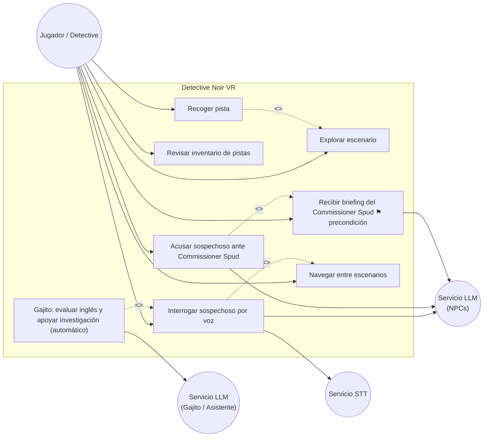
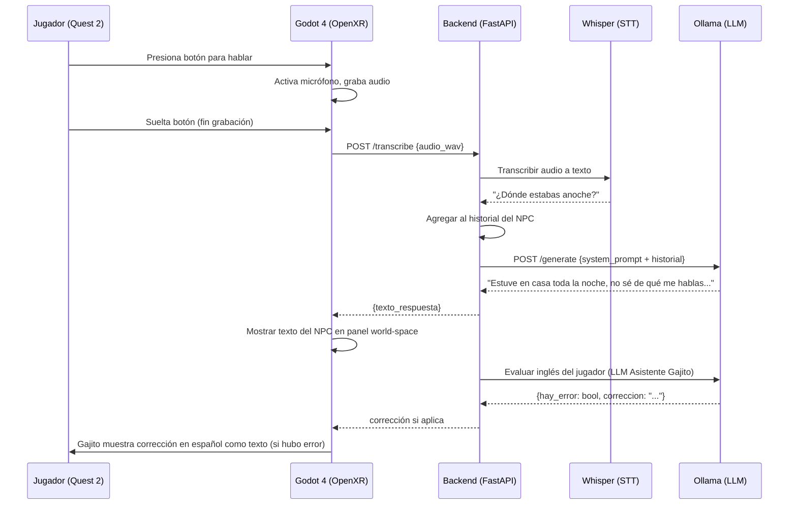
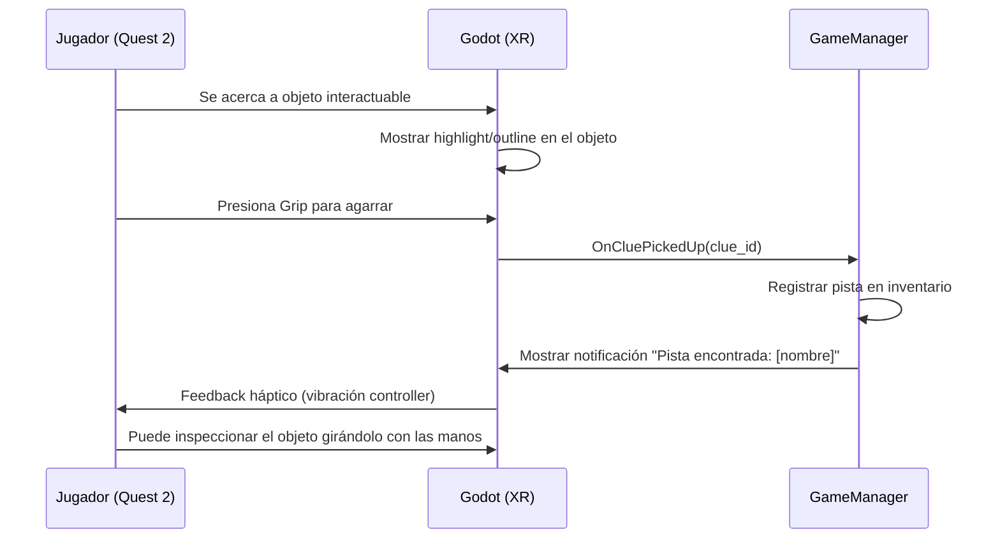
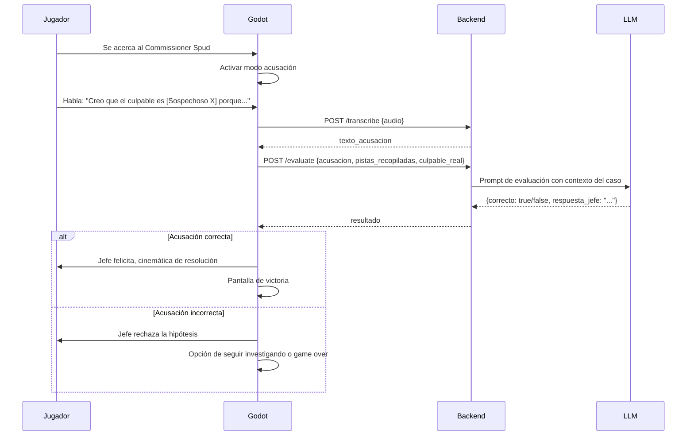
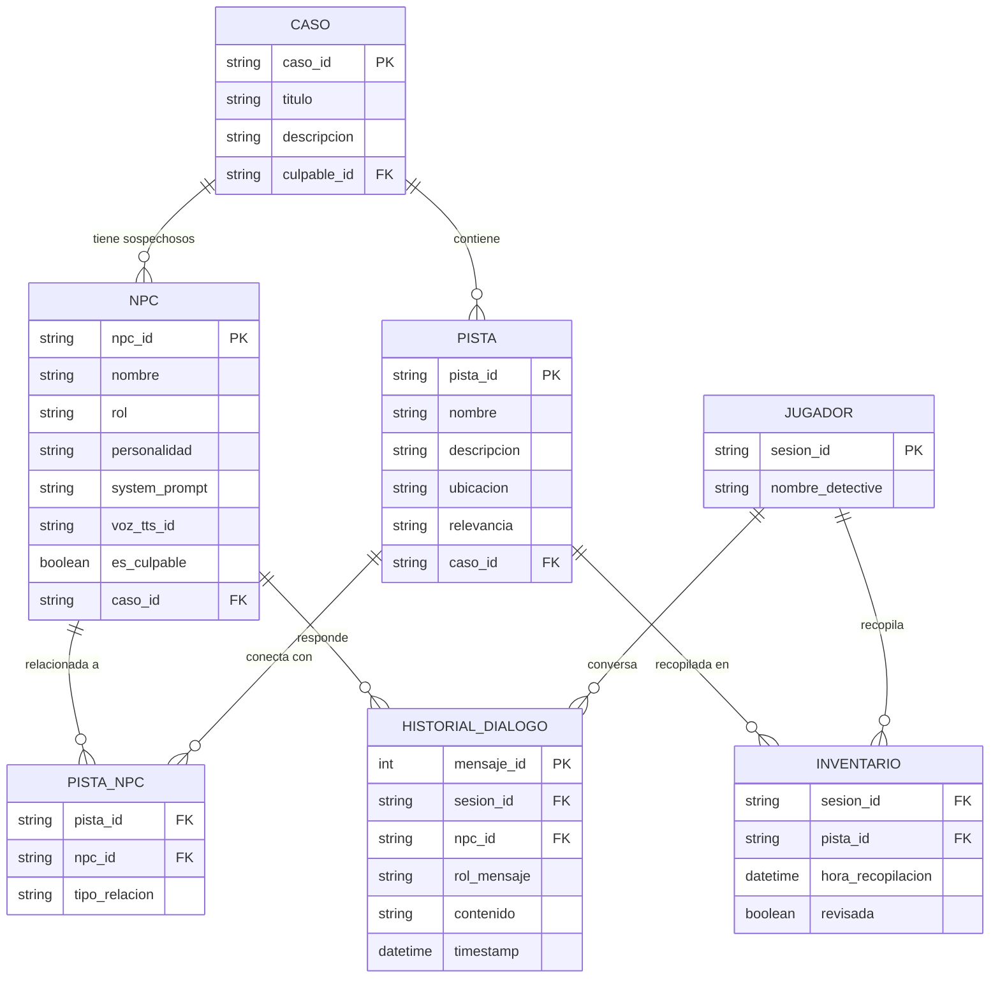
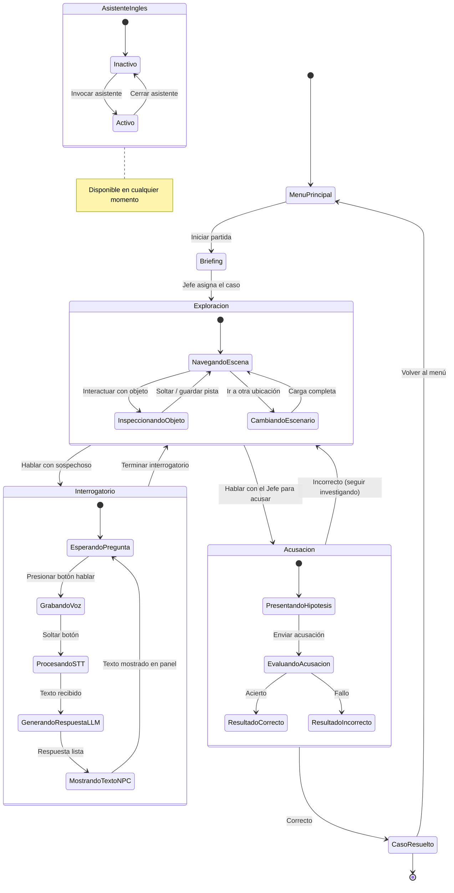

# Entrega 1: Etapa de Diseño — "Detective Noir VR"
## ICI5442 – Tecnologías Emergentes

> **Fecha de entrega:** Domingo 12 de abril de 2026  
> **Equipo:** Ignacio Cuevas, Martin Cevallos, Sofia Meza, Diego Espinosa  
> **Tema:** LLM con Chatbot en un entorno 3D con VR (Videojuego)  
> **Motor:** Godot 4 + OpenXR + XR Tools  
> **Plataforma:** Meta Quest 2  

---

## 1. Objetivos

### 1.1. Objetivo General
Desarrollar un prototipo funcional de un videojuego de detectives en Realidad Virtual (Meta Quest 2) que integre un chatbot basado en un Gran Modelo de Lenguaje (LLM) para la interacción con personajes no jugables (NPCs) mediante voz en inglés. Incorpora un componente de aprendizaje activo donde un ayudante LLM corrige los errores gramaticales y de pronunciación del jugador en tiempo real, con el propósito de explorar la convergencia de tecnologías emergentes (VR + IA generativa) en un contexto inmersivo de entretenimiento educativo.

### 1.2. Objetivos Específicos
1. **Diseñar e implementar un entorno 3D inmersivo** con ambientación noir en Godot 4, optimizado para Meta Quest 2, que permita al jugador explorar escenarios e interactuar con objetos y pistas.
2. **Integrar un sistema de Speech-to-Text (STT)** que permita la comunicación oral en inglés del jugador (Limonchero) hacia los NPCs, cuyas respuestas se mostrarán exclusivamente como texto en pantalla (sin síntesis de voz).
3. **Desarrollar un chatbot conversacional basado en LLM** con prompts especializados para cada NPC, dotándolos de personalidad, información y comportamiento únicos en inglés para los interrogatorios.
4. **Implementar un asistente LLM** (Gajito) que apoye al jugador en español: sugiera cómo formular preguntas antes de acercarse a un NPC, aclare respuestas de los NPCs, y corrija errores gramaticales en inglés de forma constructiva cuando el jugador los cometa.
5. **Evaluar la usabilidad, inmersión y aceptación del prototipo** mediante pruebas con usuarios reales, utilizando instrumentos validados (SUS, IMI, TAM) y cuestionarios pre/post experiencia.

---

## 2. Metodología de Desarrollo

### 2.1. Metodología seleccionada: Scrum Adaptado

Se utilizará una adaptación de la metodología ágil **Scrum**, ajustada a un equipo académico de 4 personas con entregas fijas.

### 2.2. Justificación
- **Iterativo e incremental:** Permite desarrollar el prototipo en sprints cortos, entregando funcionalidad progresivamente (alineado con las 3 entregas del curso).
- **Flexibilidad:** La naturaleza experimental del proyecto (LLM + VR) requiere adaptación constante ante problemas técnicos no previstos (latencia, compatibilidad, etc.).
- **Roles claros:** Facilita la distribución de trabajo entre 4 integrantes.
- **Retroalimentación temprana:** Las revisiones al final de cada sprint permiten corregir el rumbo antes de las entregas formales.

### 2.3. Adaptación al contexto académico

| Concepto Scrum | Adaptación |
|---------------|------------|
| Sprint | 1-2 semanas (alineados a hitos de entrega) |
| Daily Standup | Reunión semanal (mín. 2 veces/semana por Discord/presencial) |
| Sprint Review | Coincide con cada entrega formal |
| Product Backlog | Lista de funcionalidades priorizadas en el GDD |
| Scrum Master | Jefe de grupo (rotativo si se desea) |
| Product Owner | Todo el equipo (las decisiones se toman en consenso) |

### 2.4. Roles del Equipo

| Integrante | Rol | Responsabilidades principales |
|------------|-----|------------------------------|
| Ignacio Cuevas | Líder técnico + VR | Configuración Godot 4 + OpenXR, locomoción, interacciones VR, export Quest 2 |
| Martin Cevallos | Backend + LLM | Servidor local (Python/FastAPI), integración Ollama/API LLM, prompts NPCs |
| Sofia Meza | Audio + STT | Pipeline de voz: Whisper (STT), integración Godot |
| Diego Espinosa | Diseño + Documentación | Modelado 3D/assets, UI/UX VR, informes, diagramas, presentaciones |

---

## 3. Plan y Programa de Trabajo

### 3.1. Estructura de Desglose del Trabajo (EDT) — 3 niveles

```
1. PROYECTO: Detective Noir VR
│
├── 1.1. GESTIÓN DEL PROYECTO
│   ├── 1.1.1. Planificación y kickoff
│   ├── 1.1.2. Seguimiento semanal y control de cambios
│   └── 1.1.3. Documentación e informes de entrega
│
├── 1.2. DISEÑO (Entrega 1)
│   ├── 1.2.1. Definición de objetivos y metodología
│   ├── 1.2.2. Diseño de arquitectura del sistema
│   ├── 1.2.3. Especificación de requisitos (RF y RNF)
│   ├── 1.2.4. Diagramas UML (casos de uso, secuencia, ER, estados)
│   ├── 1.2.5. Diseño de escenarios y narrativa
│   ├── 1.2.6. Mockups de vistas principales VR
│   └── 1.2.7. Prototipo básico funcional (PoC)
│       ├── 1.2.7.1. Setup Godot 4 + OpenXR + XR Tools
│       ├── 1.2.7.2. Escena VR mínima con 1 NPC
│       ├── 1.2.7.3. Pipeline STT → LLM → Texto funcional
│       ├── 1.2.7.4. Demostración en Quest 2
│
├── 1.3. DESARROLLO CORE (Entrega 2 — 70%)
│   ├── 1.3.1. Entorno 3D
│   │   ├── 1.3.1.1. Escena: Oficina del detective
│   │   ├── 1.3.1.2. Escena: Escena del crimen
│   │   └── 1.3.1.3. Escena: Sala de interrogatorio
│   ├── 1.3.2. Mecánicas VR
│   │   ├── 1.3.2.1. Locomoción (teletransporte + continua)
│   │   ├── 1.3.2.2. Sistema de interacción con objetos
│   │   └── 1.3.2.3. Inventario de pistas VR
│   ├── 1.3.3. Sistema de IA
│   │   ├── 1.3.3.1. NPCs con prompts LLM individuales (3-4)
│   │   ├── 1.3.3.2. Sistema de diálogo con historial
│   │   └── 1.3.3.3. Asistente LLM en español evaluador de gramática inglesa
│   ├── 1.3.4. Sistema de audio
│   │   ├── 1.3.4.1. Captura y envío de audio (STT)
│   │   ├── 1.3.4.2. Visualización de respuesta NPC en panel world-space
│   │   └── 1.3.4.3. Música y SFX ambientales
│   └── 1.3.5. Diseño de pruebas con usuarios
│       ├── 1.3.5.1. Definición de escenarios de prueba
│       ├── 1.3.5.2. Cuestionarios pre/post (SUS, IMI, AEQ)
│       └── 1.3.5.3. Protocolo de prueba piloto
│
├── 1.4. FINALIZACIÓN Y VALIDACIÓN (Entrega 3)
│   ├── 1.4.1. Pulido visual y optimización (≥72 FPS en Quest 2)
│   ├── 1.4.2. Correcciones de la Entrega 2
│   ├── 1.4.3. Implementación de funcionalidades restantes
│   ├── 1.4.4. Pruebas con usuarios reales
│   │   ├── 1.4.4.1. Ejecución de prueba piloto
│   │   ├── 1.4.4.2. Aplicación de cuestionarios
│   │   └── 1.4.4.3. Recopilación de evidencia (video/fotos)
│   ├── 1.4.5. Análisis de resultados
│   └── 1.4.6. Build final APK + código fuente
│
└── 1.5. PRESENTACIONES Y DEFENSA
	├── 1.5.1. Presentación Entrega 1 (5 min)
	├── 1.5.2. Presentación Entrega 2 (5 min)
	└── 1.5.3. Presentación Entrega 3 (5 min)
```

### 3.2. Programa de Actividades

| Fase | Actividad | Entregable | RRHH | Semana |
|------|-----------|-----------|------|--------|
| **Diseño** | Objetivos y metodología | Informe §1-2 | Int. 4 | S1 (7-12 abr) |
| **Diseño** | EDT + Gantt | EDT + Gantt | Int. 4 | S1 |
| **Diseño** | Arquitectura y requisitos | Diagramas + tablas RF/RNF | Int. 1, 2 | S1 |
| **Diseño** | Diagramas UML | Casos de uso, secuencia, ER, estados | Int. 4 | S1 |
| **Diseño** | Mockups VR | Imágenes/sketches | Int. 4 | S1 |
| **Diseño** | Setup Godot 4 + OpenXR | Proyecto Godot configurado | Int. 1 | S1 |
| **Diseño** | PoC: STT→LLM→Texto | Pipeline funcional | Int. 2, 3 | S1 |
| **Diseño** | PoC: Escena VR + NPC | Demo en Quest 2 | Todos | S1 |
| **Dev Core** | Entorno 3D (oficina, crimen, interrog.) | 3 escenas Godot | Int. 1, 4 | S2-S5 |
| **Dev Core** | Locomoción + interacciones | Mecánicas VR | Int. 1 | S2-S3 |
| **Dev Core** | 3-4 NPCs con prompts | Sistema NPC | Int. 2 | S3-S5 |
| **Dev Core** | STT en juego | Audio pipeline (captura y transcripción) | Int. 3 | S2-S4 |
| **Dev Core** | Flujo completo de juego | Gameplay loop | Todos | S5-S6 |
| **Dev Core** | Asistente de inglés | Chatbot auxiliar | Int. 2 | S5-S6 |
| **Dev Core** | Diseño pruebas usuarios | Protocolo + cuestionarios | Int. 4 | S6-S7 |
| **Dev Core** | Video demo avance | Video MP4 | Todos | S8 |
| **Final** | Correcciones + pulido | Build optimizado | Todos | S9-S10 |
| **Final** | Pruebas con usuarios | Datos + evidencia | Todos | S10-S11 |
| **Final** | Build final + código | APK + repo Git | Todos | S12 |

### 3.3. Carta Gantt

> **Nota:** Se recomienda transferir esta tabla a una herramienta como GanttProject, Excel o Google Sheets para una visualización más detallada.

```
SEMANA →        S1      S2      S3      S4      S5      S6      S7      S8      S9      S10     S11     S12
				7-12    14-20   21-27   28abr   5-11    12-18   19-25   26may   2-8     9-15    16-22   23-29
				abr     abr     abr     -4may   may     may     may     -1jun   jun     jun     jun     jun
────────────────────────────────────────────────────────────────────────────────────────────────────────────
GESTIÓN         ████████████████████████████████████████████████████████████████████████████████████████████
Planificación   ████
Seguimiento          ████████████████████████████████████████████████████████████████████████████████████

DISEÑO
Objetivos/Met.  ████
EDT + Gantt     ████
Arquitectura    ████
Diagramas UML   ████
Mockups         ████
PoC Godot+XR    ████████
PoC STT→LLM    ████████
▲ ENTREGA 1     ──X (12 abr)

DESARROLLO
Entorno 3D              ████████████████████████
Locomoción VR           ████████
NPCs + LLM                      ████████████████
Audio STT               ████████████████
Gameplay loop                           ████████
Asist. inglés                           ████████
Diseño pruebas                                  ████████
Video demo                                              ████
▲ ENTREGA 2                                              ──X (~1 jun)

FINALIZACIÓN
Correcciones                                                    ████████
Pruebas users                                                           ████████
Build final                                                                     ████
▲ ENTREGA 3                                                                      ──X (~29 jun)

PRESENTACIONES
Defensa E1      ──X
Defensa E2                                                      ──X
Defensa E3                                                                       ──X
```

---

## 4. Diseño del Prototipo

### 4.1. Esquema General

```
┌──────────────────────────────────────────────────────────────────┐
│              DETECTIVE NOIR VR — "El Agave y La Luna"            │
│                                                                  │
│  ┌─────────────┐    ┌──────────────┐    ┌────────────────────┐  │
│  │  VESTÍBULO  │    │  SALÓN /     │    │  SALA DE           │  │
│  │  / ENTRADA  │───►│  ESCENA DEL  │───►│  INTERROGATORIO    │  │
│  │             │    │  CRIMEN      │    │                    │  │
│  │[Commissioner│    │ [Pista 1-5+] │    │ ┌──┐┌──┐┌──┐┌──┐  │  │
│  │   Spud]     │    │ [Gajito]  │    │ │S1││S2││S3││S4│  │  │
│  │             │    │ [Ambiente]   │    │ └──┘└──┘└──┘└──┘  │  │
│  └─────────────┘    └──────────────┘    └────────────────────┘  │
│         │                                         │              │
│         └──────────── ACUSACIÓN ◄─────────────────┘              │
│                                                                  │
│  ┌──────────────────────────────────────────────────────────┐   │
│  │                CAPA DE INTELIGENCIA ARTIFICIAL            │   │
│  │  Micrófono → STT (Whisper) → LLM (Ollama) → Texto (panel)│   │
│  │              + Gajito (asistente en español)           │   │
│  └──────────────────────────────────────────────────────────┘   │
│                                                                  │
│  ┌──────────────────────────────────────────────────────────┐   │
│  │              ARQUITECTURA CLIENTE-SERVIDOR                │   │
│  │  Quest 2 (Godot) ◄───WiFi Local───► PC (Python+FastAPI)  │   │
│  └──────────────────────────────────────────────────────────┘   │
└──────────────────────────────────────────────────────────────────┘
```

### 4.2. Requisitos Funcionales

| ID | Requisito | Prioridad |
|----|-----------|-----------|
| RF-01 | El jugador puede moverse por los escenarios VR usando teletransporte o movimiento continuo | Alta |
| RF-02 | El jugador puede recoger e inspeccionar pistas interactuando con objetos 3D mediante los controles VR | Alta |
| RF-03 | El jugador (Limonchero) puede hablar con los NPCs usando el micrófono del casco Quest 2 en inglés (Speech-to-Text) | Alta |
| RF-04 | Cada NPC responde en INGLÉS con una personalidad única generada por el LLM según su prompt individual | Alta |
| RF-05 | Las respuestas del NPC se muestran como **texto** en un panel world-space (subtítulos) | Alta |
| RF-06 | El jugador puede acusar a un sospechoso presentando su hipótesis al NPC Jefe | Alta |
| RF-07 | El sistema evalúa si la acusación es correcta y muestra un desenlace apropiado (éxito/fracaso) | Alta |
| RF-08 | El jugador dispone de un inventario visual en VR para revisar las pistas recopiladas | Media |
| RF-09 | Se muestran subtítulos en un panel world-space con el diálogo (lo que dice el jugador y el NPC) | Media |
| RF-10 | El asistente Gajito analiza el input del jugador (STT) de forma automática y ofrece correcciones en español si se detectan errores gramaticales; también puede sugerir preguntas y aclarar respuestas de los NPCs | Alta |
| RF-11 | El jugador puede navegar entre los distintos escenarios (oficina, escena del crimen, interrogatorio) | Alta |
| RF-12 | El sistema conserva el historial de conversación con cada NPC durante la partida | Media |

### 4.3. Requisitos No Funcionales

| ID | Requisito | Métrica objetivo |
|----|-----------|-----------------|
| RNF-01 | El juego debe mantener un framerate estable en Quest 2 | ≥ 72 FPS |
| RNF-02 | La latencia total del pipeline de voz (STT + LLM) hasta mostrar texto debe ser aceptable | < 5 segundos |
| RNF-03 | El sistema STT debe reconocer **inglés** hablado con precisión aceptable, incluso con acento latino | > 85% accuracy |
| RNF-04 | El juego se comunica con el servidor local vía WiFi (misma red) | Latencia red < 50ms |
| RNF-05 | La experiencia VR no debe inducir mareos (motion sickness) | Evaluación cualitativa |
| RNF-06 | El juego debe funcionar de manera autónoma con un servidor local sin acceso a internet | 100% offline-capable (con Ollama) |
| RNF-07 | El sistema debe soportar sesiones de juego de al menos 20 minutos continuos | Sin crashes ni memory leaks |
| RNF-08 | La interfaz VR debe ser intuitiva sin necesidad de tutorial extenso | SUS ≥ 68 (usabilidad aceptable) |

### 4.4. Diagrama de Casos de Uso

> **Nota:** Mermaid no soporta diagramas de casos de uso UML nativamente. Se usa `graph LR` con etiquetas `<<include>>` y `<<extend>>` para aproximar la notación UML estándar.



### 4.5. Diagramas de Secuencia

#### 4.5.1. Caso de Uso: Interrogar Sospechoso por Voz



#### 4.5.2. Caso de Uso: Recoger Pista



#### 4.5.3. Caso de Uso: Acusar ante el Jefe



### 4.6. Diagrama Entidad-Relación



### 4.7. Diagrama de Estados del Juego



### 4.8. Mockups de Vistas Principales

`[TODO: Insertar mockups. Se recomienda crear sketches rápidos en papel o Figma de las siguientes vistas:]`

1. **Vista del jugador en la oficina del detective** (tablón de pistas en la pared, jefe sentado)
2. **Vista de la escena del crimen** (objetos con highlight interactuable)
3. **Vista de interrogatorio** (sospechoso sentado frente al jugador, subtítulos visibles)
4. **Vista del inventario de pistas** (panel flotante con pistas recopiladas)
5. **Vista del asistente de inglés** (panel en la muñeca o flotante)

---

## 5. Prototipo Básico Funcional (Prueba de Concepto)

### 5.1. Caso de Uso Demostrado
**CU-04: Interrogar sospechoso por voz** — Es el caso de uso más representativo porque demuestra la integración de las tecnologías clave: VR + STT + LLM con respuesta en texto.

### 5.2. Descripción del Prototipo
Una escena minimalista en Godot con:
- Un entorno VR básico (sala con mesa y silla) corriendo en Meta Quest 2
- 1 NPC (modelo 3D básico o placeholder) con un system prompt de personalidad
- Pipeline funcional: el jugador habla → Whisper transcribe → LLM genera respuesta → texto mostrado en panel world-space del NPC

### 5.3. Stack técnico del prototipo

| Componente | Herramienta |
|------------|------------|
| Motor | Godot 4 + OpenXR + XR Tools |
| VR | Meta Quest 2 (OpenXR) |
| Backend | Python + FastAPI (corriendo en PC local) |
| LLM | Ollama con llama3 o mistral |
| STT | faster-whisper (modelo medium) |
| Respuesta NPC | Texto mostrado en panel world-space (sin síntesis de voz) |
| Comunicación | HTTP REST (Quest 2 ↔ PC vía WiFi) |

### 5.4. Pasos para reproducir el prototipo

```
1. PC: Instalar Ollama → ollama pull llama3
2. PC: Instalar Python → pip install fastapi uvicorn faster-whisper
3. PC: Ejecutar servidor → uvicorn server:app --host 0.0.0.0 --port 8000
4. Godot: Crear proyecto con OpenXR + plugin XR Tools instalado
5. Godot: Crear escena con XROrigin3D, 1 NPC, botón de hablar
6. Godot: Script GDScript que graba audio, envía HTTP al servidor, muestra respuesta en panel world-space
7. Build APK para Quest 2 → instalar vía SideQuest/adb
8. Conectar Quest 2 a la misma red WiFi que el PC
9. Probar: hablar al NPC en inglés y recibir respuesta
```

### 5.5. Verificación de Factibilidad

| Aspecto | Verificación | Resultado esperado |
|---------|-------------|-------------------|
| VR en Quest 2 | Godot exporta y corre en Quest 2 | ✅ ≥72 FPS |
| STT funciona | Whisper transcribe audio del micrófono en inglés | ✅ Texto correcto en inglés |
| LLM responde | Ollama genera respuesta coherente con el prompt del NPC en inglés | ✅ Texto en personaje mostrado en panel |
| LLM evalúa | El asistente detecta un error al hablar y corrige en español | ✅ Corrección precisa en español |
| Latencia total | Pipeline completo end-to-end | ✅ < 5 segundos |
| Comunicación WiFi | Quest 2 ↔ PC sin pérdida | ✅ Conexión estable |

---

## 6. Viabilidad Técnica

El prototipo básico funcional (sección 5) sirve para verificar que la combinación de tecnologías es factible:

- **VR + Godot 4 + Quest 2:** Godot 4 soporta OpenXR de forma nativa, permitiendo despliegue en Meta Quest 2 mediante exportación Android. El plugin XR Tools provee locomoción, manos y utilidades VR listas para usar.
- **LLM local (Ollama):** Permite ejecutar modelos como llama3 sin costo y sin internet. La latencia con GPU NVIDIA es ~1-2 segundos.
- **STT (Whisper):** El modelo `medium` de Whisper soporta inglés de forma excelente y corre en GPU local.
- **Respuesta NPC (texto):** Las respuestas del LLM se muestran directamente en un panel world-space en Godot, sin síntesis de voz. Esto simplifica el pipeline y elimina latencia adicional.
- **Arquitectura cliente-servidor local:** Práctica estándar en desarrollo VR. El Quest 2 se comunica por WiFi con el PC en la misma red.

La combinación es **coherente con los objetivos** del proyecto: crear una experiencia inmersiva que use IA generativa para interacción natural con NPCs, dentro de un contexto de entretenimiento educativo.

---

> **Nota:** Este documento corresponde a la Entrega 1 del proyecto semestral. Las entregas siguientes actualizarán y expandirán su contenido según la retroalimentación recibida.
